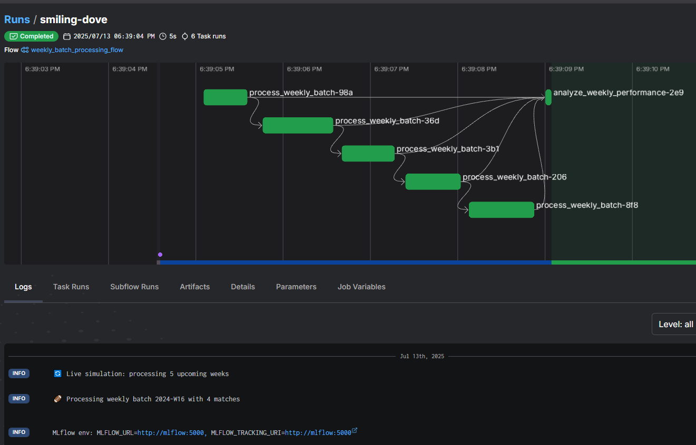
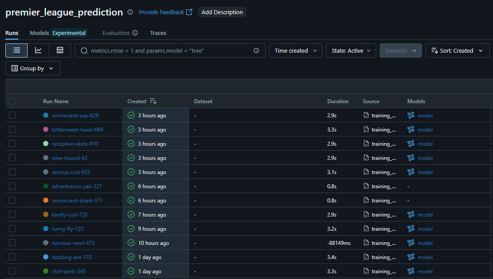
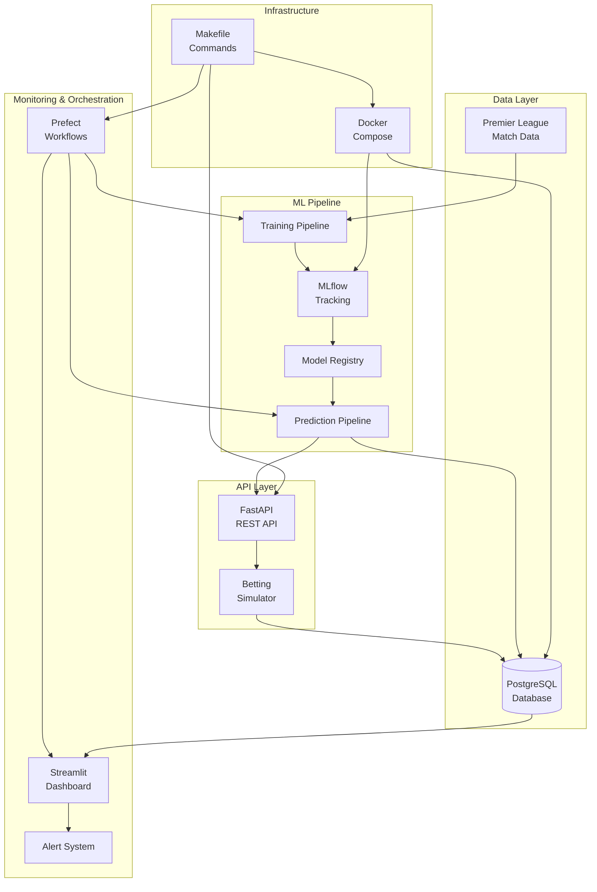

# 🏆 Premier League Match Predictor - MLOps System

[](https://python.org)
[](https://fastapi.tiangolo.com)
[](https://mlflow.org)
[](https://prefect.io)
[](https://streamlit.io)
[](https://docker.com)
[](https://github.com/features/actions)
[](https://github.com/astral-sh/ruff)
[](https://pytest.org)
[](LICENSE)

> **A production-ready MLOps pipeline for Premier League match prediction with automated monitoring, orchestration, and betting simulation.**

## 🎓 About This Project

This project is my final capstone for the **[MLOps Zoomcamp](https://github.com/DataTalksClub/mlops-zoomcamp)** course by [DataTalks.Club](https://datatalks.club/). The course provided comprehensive training in machine learning operations, covering everything from experiment tracking to production deployment.

### 💡 Motivation

As a football enthusiast and ML practitioner, I wanted to create a project that combines my passion for the Premier League with the MLOps skills learned throughout the course. This system demonstrates:

- **Real-world application** of MLOps principles to sports analytics
- **End-to-end pipeline** from data ingestion to production deployment
- **Production-ready practices** including monitoring, orchestration, and automated workflows
- **Practical value** through betting simulation and match prediction

The goal was to build not just a model, but a complete MLOps system that could realistically be deployed and maintained in production, showcasing all the key concepts from the course.

## 📋 Table of Contents
- [🎯 Overview](#-overview)
- [✨ Features](#-features)
- [🏗️ Architecture](#️-architecture)
- [🚀 Quick Start](#-quick-start)
- [🧪 Testing](#-testing)
- [📊 Monitoring & Orchestration](#-monitoring--orchestration)
- [🚀 Cloud Deployment](#-cloud-deployment)
- [🛠️ Development](#️-development)
- [📡 API Endpoints](#-api-endpoints)
- [📚 Documentation](#-documentation)

## 🎯 Overview

This MLOps system provides a complete end-to-end pipeline for predicting Premier League match outcomes. Built with modern MLOps practices, it includes automated training, real-time predictions, comprehensive monitoring, and orchestrated workflows.

### 🎪 Key Highlights
- **🤖 61.84% Model Accuracy** - Random Forest classifier with 15 engineered features
- **⚡ Real-time Predictions** - FastAPI-powered REST API with sub-second response times
- **📊 Interactive Dashboard** - Streamlit dashboard with real-time metrics and visualizations
- **🔄 Automated Orchestration** - Prefect workflows for training, monitoring, and alerts
- **💰 Betting Simulation** - Automated betting strategy testing and validation
- **🐳 Containerized Deployment** - Docker Compose for easy deployment and scaling
- **🧪 Full Test Coverage** - Unit and integration tests for all components
- **🚀 Cloud Deployment** - Ready-to-deploy configurations for Railway, Render, and Fly.io
- **🔧 CI/CD Pipeline** - GitHub Actions for automated testing, linting, and deployment
- **📝 Code Quality** - Ruff linting and formatting with pre-commit hooks

## ✨ Features

### 🔮 Machine Learning
- **Premier League Match Prediction** - Predict match outcomes (Home/Draw/Away)
- **Feature Engineering** - 15 carefully crafted features including team form, head-to-head records
- **Model Versioning** - MLflow integration for experiment tracking and model registry
- **Automated Retraining** - Scheduled model updates based on performance thresholds

### 🚀 API & Services
- **FastAPI REST API** - Comprehensive endpoints for predictions, model info, and betting
- **Real-time Data Integration** - Automated data fetching and processing
- **Betting Simulation** - Strategy testing with configurable parameters
- **Health Monitoring** - Comprehensive health checks and status endpoints

### 📊 Monitoring & Observability
- **Streamlit Dashboard** - Interactive web dashboard for model and system monitoring
- **Performance Tracking** - Model accuracy, drift detection, and prediction confidence
- **Alert System** - Automated notifications for performance degradation
- **Comprehensive Logging** - Structured logging across all components

### 🔄 Orchestration & Automation
- **Prefect Workflows** - 4 automated workflows for different operational needs:
  - **Hourly Monitoring** - Model performance and drift detection
  - **Daily Predictions** - Generate predictions for upcoming matches
  - **Weekly Retraining** - Automated model retraining evaluation
  - **Emergency Retraining** - Manual trigger for immediate model updates



## 🚀 Quick Start

### Prerequisites
- Python 3.10+ with `uv` package manager
- PostgreSQL (local or Docker)
- 15 minutes setup time

### Setup & Run

#### 🚀 Quick Start (Recommended)
```bash
# 1. Clone and setup
git clone https://github.com/your-username/mlops-2025-final_project.git
cd mlops-2025-final_project

# 2. One-command setup and start
make setup
make start

# 3. Test system
make test
```

#### 🔧 Manual Setup (Alternative)
```bash
# 1. Clone and install
git clone https://github.com/your-username/mlops-2025-final_project.git
cd mlops-2025-final_project
uv sync

# 2. Start Docker services (PostgreSQL)
docker-compose up -d

# 3. Initialize system
cp config.env.example .env
uv run python scripts/setup_database.py

# 4. Start core services (5 terminals)
uv run mlflow server --host 127.0.0.1 --port 5000                           # Terminal 1
uv run python -m src.pipelines.training_pipeline                            # Terminal 2 (once)
cd src/api && uv run uvicorn main:app --host 0.0.0.0 --port 8000 --reload  # Terminal 3
uv run prefect server start --host 0.0.0.0 --port 4200                     # Terminal 4
uv run python scripts/start_dashboard.py                                   # Terminal 5

# 5. Fix any database issues
uv run python scripts/fix_database.py

# 6. Test complete system
uv run python scripts/test_simple_integration.py
uv run python scripts/test_simple_monitoring.py
```

#### 🛠️ Makefile Commands
```bash
# Service Management
make start       # Start all services
make stop        # Stop all services
make restart     # Restart all services
make status      # Check service status

# Development
make setup       # Complete setup
make test        # Run integration tests
make train       # Run training pipeline
make clean       # Clean up resources

# Individual Services
make start-docker    # Start Docker only
make start-mlflow    # Start MLflow only
make start-api       # Start API only
make start-prefect   # Start Prefect only
make start-dashboard # Start Streamlit dashboard only

# View all commands
make help
```

### 🎯 Access Points
- **API**: http://localhost:8000
- **API Docs**: http://localhost:8000/docs
- **MLflow**: http://127.0.0.1:5000
- **Prefect UI**: http://localhost:4200
- **Streamlit Dashboard**: http://localhost:8501
- **Health Check**: http://localhost:8000/health

### 🔧 Troubleshooting
If you encounter issues with the dashboard or other components, use the troubleshooting script:

```bash
# Run the troubleshooting script
python scripts/dashboard_troubleshoot.py
```

This script will:
- Check database connectivity
- Verify required tables exist
- Check if MLflow model is available
- Ensure Streamlit port is available
- Offer to fix common issues automatically

### 🛠️ Simplified Setup

We've simplified the database and model setup to avoid common permission issues. For details, see [Simplified Setup Guide](docs/simplified_setup.md).

Quick commands:
- `make fix-db` - Fix database permissions and schema issues
- `make fix-model` - Create a mock model in MLflow
- `make troubleshoot` - Run the troubleshooting script to diagnose and fix issues

## ✅ What's Working

### Core Features
- **Random Forest Model** - 61.84% accuracy on 3,040 Premier League matches
- **REST API** - FastAPI with comprehensive endpoints
- **Real-time Predictions** - Premier League match outcomes
- **Betting Simulation** - Automated betting strategy testing
- **MLflow Integration** - Model tracking and versioning
- **PostgreSQL Database** - Complete data persistence



### Monitoring & Orchestration
- **Prefect Workflows** - 4 automated flows for operational needs
- **Streamlit Dashboard** - Interactive monitoring with real-time visualizations
- **Performance Tracking** - Model drift detection and accuracy monitoring
- **Alert System** - Automated notifications for performance degradation

## 🏗️ Architecture

### 🔄 System Architecture Overview



### 🧩 Component Details

| Component | Technology | Purpose | Port |
|-----------|------------|---------|------|
| **API Server** | FastAPI + Uvicorn | REST API endpoints | 8000 |
| **ML Tracking** | MLflow | Experiment tracking & model registry | 5000 |
| **Database** | PostgreSQL | Data persistence & metrics | 5432 |
| **Orchestration** | Prefect | Workflow automation | 4200 |
| **Dashboard** | Streamlit | Interactive monitoring | 8501 |
| **Containerization** | Docker Compose | Service orchestration | - |

### 🔄 Data Flow

1. **Training Flow**: `Data → Feature Engineering → Model Training → MLflow → Model Registry`
2. **Prediction Flow**: `API Request → Model Loading → Feature Processing → Prediction → Response`
3. **Monitoring Flow**: `Metrics Collection → PostgreSQL → Streamlit → Alerts`
4. **Orchestration Flow**: `Prefect Scheduler → Workflows → Monitoring → Notifications`

## 📁 Project Structure

```
mlops-2025-final_project/
├── 📁 src/
│   ├── 📁 api/                    # FastAPI application
│   ├── 📁 pipelines/              # ML training & prediction pipelines
│   ├── 📁 betting_simulator/      # Betting strategy simulation
│   ├── 📁 monitoring/             # Metrics collection & storage
│   ├── 📁 orchestration/          # Prefect workflows
│   ├── 📁 dashboard/              # Streamlit dashboard
│   ├── 📁 data_integration/       # Data fetching & processing
│   └── 📁 retraining/             # Entry point for the MLOps betting simulation system
├── 📁 tests/                      # Test suites
│   ├── 📁 unit/                   # Unit tests
│   └── 📁 integration/            # Integration tests
├── 📁 scripts/                    # Setup & testing scripts
├── 📁 data/                       # Training data & datasets
├── 📁 alerts/                     # Alert configurations
├── 📁 deployment/                 # Cloud deployment documentation
├── 📁 .github/workflows/          # CI/CD pipelines
├── 📄 docker-compose.yml         # Container orchestration
├── 📄 Dockerfile                 # Production container image
├── 📄 railway.toml               # Railway deployment config
├── 📄 render.yaml                # Render deployment config
├── 📄 .pre-commit-config.yaml    # Pre-commit hooks
├── 📄 Makefile                   # Development commands
├── 📄 pyproject.toml             # Python dependencies & config
└── 📄 README.md                  # This file
```


## 🧪 Testing

### Running Tests
```bash
make test        # Run all integration tests
make test-orch   # Test orchestration components
make health      # Health check all services
```

### Test Coverage
- ✅ **Unit Tests** - Core business logic and utilities
- ✅ **Integration Tests** - End-to-end workflow testing
- ✅ **API Endpoints** - All REST endpoints tested
- ✅ **ML Pipeline** - Training and prediction workflows
- ✅ **Database** - Schema and data integrity
- ✅ **Monitoring** - Metrics collection and alerts
- ✅ **Orchestration** - Prefect workflow execution
- ✅ **CI/CD Pipeline** - Automated testing on pull requests

### Individual Test Scripts
```bash
# Run unit tests
uv run pytest tests/unit/ -v

# Run integration tests
uv run pytest tests/integration/ -v

# Test API integration
uv run python scripts/test_simple_integration.py

# Test monitoring workflows
uv run python scripts/test_simple_monitoring.py

# Test end-to-end orchestration
uv run python scripts/test_end_to_end_monitoring.py
```

### Code Quality
```bash
# Run linting
uv run ruff check src/ tests/

# Run formatting
uv run ruff format src/ tests/

# Run pre-commit hooks
uv run pre-commit run --all-files
```

## 📊 Monitoring & Orchestration

### Prefect Workflows
The system includes 4 automated workflows:

```bash
# Start Prefect server
uv run prefect server start --host 0.0.0.0 --port 4200

# Deploy and run workflows
uv run python -m src.orchestration.scheduler

# Manual workflow triggers
uv run python scripts/test_simple_orchestration.py
```

**Available Flows:**
- **Hourly Monitoring** - Model performance & drift detection
- **Daily Predictions** - Generate predictions for upcoming matches
- **Weekly Retraining** - Automated model retraining evaluation
- **Emergency Retraining** - Manual retraining trigger

### Streamlit Dashboard
Interactive monitoring with real-time visualizations:

```bash
# Start Streamlit dashboard
./scripts/start_dashboard.py

# Alternative method
cd src/dashboard && uv run streamlit run streamlit_app.py --server.port 8501 --server.headless true
```

**Dashboard Features:**
- **Overview** - Landing page with feature explanations and system status
- **Model Performance** - Accuracy, precision, recall metrics over time
- **Predictions** - Recent match predictions and confidence analysis
- **Betting Performance** - ROI, win rate, and betting history charts
- **Live Prediction** - Interactive tool for generating custom predictions
- **Workflows** - Prefect workflow management and scheduling
- **Simulation** - Season simulation with configurable parameters

**Troubleshooting Dashboard Issues:**
```bash
# Run the dashboard troubleshooter
python scripts/dashboard_troubleshoot.py

# Fix database issues
python scripts/fix_database.py
```

### Alert Conditions
- Model accuracy drops below 55%
- API response time exceeds 1 second
- Database connection failures
- Service downtime detection

## 🚀 Cloud Deployment

The system is ready for cloud deployment with multiple platform options:

### Deployment Platforms

#### Railway (Recommended)
```bash
# 1. Connect your GitHub repository to Railway
# 2. Add PostgreSQL service
# 3. Deploy automatically using railway.toml configuration
```

#### Render
```bash
# 1. Connect repository to Render
# 2. Use render.yaml blueprint for automatic setup
# 3. Add PostgreSQL database service
```

#### Fly.io
```bash
# Install Fly CLI and deploy
fly launch
fly deploy
```

### Docker Deployment
```bash
# Build production image
docker build -t premier-league-mlops .

# Run with environment variables
docker run -p 8000:8000 \
  -e POSTGRES_HOST=your-db-host \
  -e POSTGRES_USER=your-db-user \
  -e POSTGRES_PASSWORD=your-db-password \
  premier-league-mlops
```

### Environment Variables
Required for cloud deployment:
- `POSTGRES_HOST`, `POSTGRES_PORT`, `POSTGRES_DB`
- `POSTGRES_USER`, `POSTGRES_PASSWORD`
- `MLFLOW_TRACKING_URI` (optional, defaults to SQLite)
- `MODEL_REGISTRATION_THRESHOLD` (optional, default: 0.6)

### Health Checks
- **Endpoint**: `/health`
- **Timeout**: 30 seconds
- **Auto-restart**: On failure

See [deployment/cloud-deployment.md](deployment/cloud-deployment.md) for detailed instructions.

## 🛠️ Development

### Development Commands
```bash
# API development
cd src/api && uv run uvicorn main:app --reload

# Run training pipeline
uv run python -m src.pipelines.training_pipeline

# Run prediction pipeline
uv run python -m src.pipelines.prediction_pipeline

# Start Streamlit dashboard
cd src/dashboard && uv run streamlit run streamlit_app.py

# Database utilities
uv run python scripts/check_db_tables.py
uv run python scripts/clean_postgres.py
uv run python scripts/setup_database.py

# Monitoring and orchestration
uv run python scripts/test_simple_monitoring.py
uv run python scripts/test_simple_orchestration.py
```

### Code Quality & Testing
```bash
# Install pre-commit hooks
uv run pre-commit install

# Run all pre-commit hooks
uv run pre-commit run --all-files

# Run specific tests
uv run pytest tests/unit/ -v
uv run pytest tests/integration/ -v

# Check code coverage
uv run pytest --cov=src tests/
```

### Workflow Features
- **Retry Logic** - Automatic retry on failures
- **Notifications** - Slack/email alerts on completion
- **Logging** - Comprehensive workflow execution logs
- **Monitoring** - Real-time workflow status tracking

### Troubleshooting
```bash
# Check service status
make status

# View logs
docker-compose logs -f

# Reset database
uv run python scripts/clean_postgres.py
uv run python scripts/setup_database.py

# Check API health
curl http://localhost:8000/health
```

## 📡 API Endpoints

### Core Endpoints
- **GET** `/health` - System health check
- **GET** `/` - API information and status
- **POST** `/predict` - Single match prediction
- **GET** `/predictions/today` - Today's match predictions
- **GET** `/model/info` - Current model information
- **GET** `/model/performance` - Model performance metrics

### Betting Endpoints
- **POST** `/betting/simulate` - Run betting simulation
- **GET** `/betting/stats` - Betting statistics
- **GET** `/betting/balance` - Current betting balance

### Monitoring Endpoints
- **GET** `/monitoring/metrics` - System metrics
- **POST** `/monitoring/alert` - Trigger alerts
- **GET** `/monitoring/drift` - Model drift analysis

### Example Usage
```bash
# Get system health
curl http://localhost:8000/health

# Make a prediction
curl -X POST http://localhost:8000/predict \
  -H "Content-Type: application/json" \
  -d '{"home_team": "Arsenal", "away_team": "Chelsea", "home_odds": 2.1, "away_odds": 3.2, "draw_odds": 3.5}'

# Get today's predictions
curl http://localhost:8000/predictions/today

# Check model performance
curl http://localhost:8000/model/performance
```

## 📚 Documentation

- **[API Documentation](API_DOCUMENTATION.md)** - Complete API reference
- **[Cloud Deployment Guide](deployment/cloud-deployment.md)** - Detailed deployment instructions

## 📄 License

This project is licensed under the MIT License - see the [LICENSE](LICENSE) file for details.

## 🙏 Acknowledgments

This project was made possible thanks to:

- **[DataTalks.Club](https://datatalks.club/)** for the excellent MLOps Zoomcamp course
- **[Alexey Grigorev](https://github.com/alexeygrigorev)** and the course instructors for their comprehensive MLOps training
- **MLOps Zoomcamp community** for support, discussions, and shared learning experiences

---

*MLOps Zoomcamp Final Project - Complete MLOps system for Premier League match prediction*
